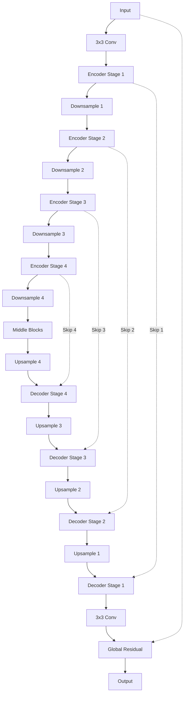

# NAFNet Architecture Reverse Engineering: Engineering Specification

## Section 1: Repository Overview

### 1.1 Repository Purpose
The **NAFNet** (Non-linear Activation Free Network) repository is the official implementation of the paper *"Simple Baselines for Image Restoration"*. Its primary goal is to challenge the necessity of complex components in image restoration networks, such as non-linear activation functions (ReLU, GELU, Sigmoid) and sophisticated attention mechanisms. By removing these and replacing them with simpler, multiplication-based alternatives, NAFNet achieves state-of-the-art performance on benchmarks like SIDD (denoising) and GoPro (deblurring) while maintaining high computational efficiency.

### 1.2 Architectural Paradigm
The repository implements two primary architectural patterns:
1.  **Hierarchical UNet**: Used for tasks where multi-scale information is critical (denoising, deblurring). It features symmetric encoder-decoder paths with downsampling and upsampling stages.
2.  **Flat Single-Scale**: Used in the **NAFSSR** variant for stereo image super-resolution, where spatial resolution is maintained or increased throughout the network without traditional UNet downsampling.

### 1.3 Folder Organization & Engineering Style
The project is built upon the **BasicSR** framework, inheriting its modular and configuration-driven design.
- **`basicsr/models/archs/`**: Contains the "blueprints" of the networks. This is where the mathematical logic resides.
- **`basicsr/models/`**: Acts as the "orchestrator," handling the interface between the data, the architecture, and the optimization process.
- **`options/`**: The "control center." Every experiment is defined by a YAML file, ensuring reproducibility without code changes.

### 1.4 Design Philosophy
- **Activation-Free**: The core innovation. Non-linearity is treated as a gating operation rather than a thresholding operation.
- **Minimalist Complexity**: Prefers depthwise convolutions and simple element-wise operations over heavy standard convolutions or complex attention modules.
- **Scalability**: The architecture is easily scaled by adjusting the "width" (base channel count) and "depth" (number of blocks per stage).

---

## Section 2: Complete File Map

The following tree describes the critical path of the repository. Files marked with `(*)` are essential for the architectural implementation.

```text
/home/ubuntu/NAFNet/
├── basicsr/
│   ├── data/
│   │   ├── paired_image_dataset.py       # Standard LQ-GT pair loading
│   │   └── transforms.py                 # Geometric augmentations
│   ├── metrics/
│   │   └── psnr_ssim.py                  # Metric calculation logic
│   ├── models/
│   │   ├── archs/
│   │   │   ├── NAFNet_arch.py (*)        # NAFNet, NAFBlock, SimpleGate
│   │   │   ├── NAFSSR_arch.py            # Stereo SR variant with SCAM
│   │   │   ├── arch_util.py (*)          # LayerNorm2d, initialization
│   │   │   └── local_arch.py (*)         # TLSC for large-scale inference
│   │   ├── losses/
│   │   │   └── losses.py (*)             # PSNRLoss definition
│   │   ├── image_restoration_model.py    # Training/Inference wrapper
│   │   └── base_model.py                 # Framework base class
│   ├── train.py                          # Training entry point
│   └── test.py                           # Testing entry point
├── options/
│   ├── train/                            # Experiment configurations
│   └── test/                             # Evaluation configurations
└── requirements.txt                      # Environment dependencies
```

### Detailed Module Analysis
| Module | Responsibility | Dependencies |
| :--- | :--- | :--- |
| `NAFNet_arch.py` | Defines the `NAFNet` class and the `NAFBlock`. It is the source of truth for the tensor flow. | `torch`, `arch_util.LayerNorm2d` |
| `arch_util.py` | Implements `LayerNorm2d` which is not natively supported for 4D tensors in older PyTorch versions. | `torch.nn` |
| `local_arch.py` | Implements Test-time Local Statistics Correction (TLSC) to handle domain shift in global pooling. | `NAFNet_arch` |
| `losses.py` | Implements `PSNRLoss`, which is a logarithmic loss targeting the PSNR metric directly. | `torch`, `numpy` |

---

## Section 3: Architecture Overview

The NAFNet architecture follows a symmetric **UNet** structure. The design is centered around the preservation of spatial information while progressively extracting high-level features.

### 3.1 The Global Structure


### 3.2 Key Components
- **Encoder**: Each stage consists of multiple `NAFBlock`s. The goal is to refine features at the current resolution.
- **Downsampling**: A $2 \times 2$ convolution with $stride=2$. It doubles the channels ($C \to 2C$) and halves the resolution ($H, W \to H/2, W/2$).
- **Middle Blocks**: The bottleneck of the UNet. It contains the highest number of channels and processes the most abstract features.
- **Upsampling**: Uses `PixelShuffle`. It reduces channels and increases resolution.
- **Decoder**: Mirrors the encoder. Features from the upsampling layer are **added** (not concatenated) to the skip connection features before being processed by `NAFBlock`s.
- **Residual Learning**: The entire network predicts the noise or blur. The final result is obtained by adding the input image to the network's output.

---

## Section 4: Tensor Flow

Understanding the shape transformations is critical for reimplementation. Below is the flow for a standard `width=64` NAFNet.

| Stage | Operation | Input Shape | Output Shape | Notes |
| :--- | :--- | :--- | :--- | :--- |
| **Input** | Image | $(B, 3, H, W)$ | $(B, 3, H, W)$ | $H, W$ must be multiples of 16 |
| **Stem** | Conv 3x3 | $(B, 3, H, W)$ | $(B, 64, H, W)$ | $C=64$ (Width) |
| **Enc 1** | $N_1$ Blocks | $(B, 64, H, W)$ | $(B, 64, H, W)$ | Spatial resolution preserved |
| **Down 1** | Conv 2x2, s2 | $(B, 64, H, W)$ | $(B, 128, H/2, W/2)$ | $C \times 2$, Res $/ 2$ |
| **Enc 2** | $N_2$ Blocks | $(B, 128, H/2, W/2)$ | $(B, 128, H/2, W/2)$ | |
| **Down 2** | Conv 2x2, s2 | $(B, 128, H/2, W/2)$ | $(B, 256, H/4, W/4)$ | |
| **Enc 3** | $N_3$ Blocks | $(B, 256, H/4, W/4)$ | $(B, 256, H/4, W/4)$ | |
| **Down 3** | Conv 2x2, s2 | $(B, 256, H/4, W/4)$ | $(B, 512, H/8, W/8)$ | |
| **Enc 4** | $N_4$ Blocks | $(B, 512, H/8, W/8)$ | $(B, 512, H/8, W/8)$ | |
| **Down 4** | Conv 2x2, s2 | $(B, 512, H/8, W/8)$ | $(B, 1024, H/16, W/16)$ | |
| **Middle** | $M$ Blocks | $(B, 1024, H/16, W/16)$ | $(B, 1024, H/16, W/16)$ | Bottleneck |
| **Up 4** | PixShuffle | $(B, 1024, H/16, W/16)$ | $(B, 512, H/8, W/8)$ | $C / 2$, Res $\times 2$ |
| **Dec 4** | Add Skip + $M_4$ | $(B, 512, H/8, W/8)$ | $(B, 512, H/8, W/8)$ | Skip from Enc 4 |
| **Head** | Conv 3x3 | $(B, 64, H, W)$ | $(B, 3, H, W)$ | Back to RGB |
| **Output** | Add Input | $(B, 3, H, W)$ | $(B, 3, H, W)$ | Final Restoration |

---

## Section 5: NAFBlock

The **NAFBlock** is the engine of the network. It is designed to be "Activation Free" by using a gating mechanism.

### 5.1 Architecture of NAFBlock
A NAFBlock consists of two sequential residual sub-blocks.

#### Sub-Block A: Spatial & Channel Mixer
1.  **LayerNorm2d**: Normalizes the input.
2.  **1x1 Conv (Expansion)**: Expands channels by factor $E_{dw}$ (default 2).
3.  **3x3 DWConv**: Depthwise convolution for spatial interaction.
4.  **SimpleGate**: Splitting and element-wise multiplication.
5.  **SCA**: Simplified Channel Attention.
6.  **1x1 Conv (Projection)**: Projects back to original channel count.
7.  **Learnable Scale ($\beta$)**: Multiplies the branch output.
8.  **Residual Add**: Adds to the sub-block input.

#### Sub-Block B: Feed-Forward Network (FFN)
1.  **LayerNorm2d**: Normalizes the output of Sub-Block A.
2.  **1x1 Conv (Expansion)**: Expands channels by factor $E_{ffn}$ (default 2).
3.  **SimpleGate**: Introduces non-linearity.
4.  **1x1 Conv (Projection)**: Projects back.
5.  **Learnable Scale ($\gamma$)**: Multiplies the branch output.
6.  **Residual Add**: Adds to the Sub-Block B input.

### 5.2 Engineering Rationale
- **Pointwise -> Depthwise -> Pointwise**: This is an Inverted Residual style, but without the ReLU. It is highly efficient in terms of parameters.
- **Learnable Scales**: Initializing $\beta$ and $\gamma$ to zero makes the block an identity function at start, significantly easing the training of deep architectures.

---

## Section 6: SimpleGate

**SimpleGate** is the replacement for non-linear activations.

### 6.1 Logic
Given input $X$ with $2C$ channels, SimpleGate splits $X$ into $X_1$ and $X_2$ (each with $C$ channels) and returns:
$$Output = X_1 \times X_2$$

### 6.2 Why it works
- **Gating Mechanism**: One half of the feature map acts as a gate for the other.
- **Information Preservation**: Unlike ReLU, which discards negative values, SimpleGate preserves the sign and magnitude information in a multiplicative way.
- **Mathematical Equivalence**: The authors show that GELU can be approximated by this gating operation, but SimpleGate is more efficient as it avoids transcendental functions (erf).

---

## Section 7: Simplified Channel Attention (SCA)

SCA is a "stripped-down" version of Squeeze-and-Excitation (SE) attention.

### 7.1 The Pipeline
1.  **Global Average Pooling**: Reduces $(B, C, H, W)$ to $(B, C, 1, 1)$.
2.  **1x1 Convolution**: A single linear layer that transforms the pooled vector.
3.  **Broadcasting Multiplication**: The original feature map is scaled by the transformed vector.

### 7.2 Comparison to SE-Net
Traditional SE-Net uses two Fully Connected (FC) layers with a ReLU in between and a Sigmoid at the end. SCA removes the second FC, the ReLU, and the Sigmoid, finding them redundant in the context of NAFNet's gating.

---

## Section 8: Normalization (LayerNorm2d)

NAFNet uses **LayerNorm** instead of BatchNorm. However, standard PyTorch `LayerNorm` expects a specific tensor layout.

### 8.1 Implementation Detail
`LayerNorm2d` computes the mean and variance across the channel dimension for each $(h, w)$ position:
$$\hat{x}_{b,c,h,w} = \frac{x_{b,c,h,w} - \mu_{b,h,w}}{\sqrt{\sigma^2_{b,h,w} + \epsilon}}$$
where $\mu$ and $\sigma$ are calculated over the $C$ channels.

### 8.2 Why LayerNorm?
In image restoration, batch sizes are often very small (e.g., 1-4 per GPU). BatchNorm's dependency on batch statistics leads to significant performance degradation. LayerNorm is independent of the batch size and the statistics of other images in the batch.

---

## Section 9: Encoder

The Encoder is a stack of stages, each containing $N_i$ NAFBlocks.

- **Downsampling**: A simple 2x2 convolution with stride 2.
- **Skip Connection**: The output of the last NAFBlock in an encoder stage is cached. This tensor is passed to the corresponding decoder stage.
- **Feature Growth**: Channels typically double at each downsampling step ($64 \to 128 \to 256 \to 512 \to 1024$).

---

## Section 10: Decoder

The Decoder reconstructs the image using upsampling and skip connections.

- **Upsampling**: `PixelShuffle` is used to increase resolution. For a $2 \times$ upsampling, the input channels are increased by $4 \times$ using a 1x1 convolution, then rearranged.
- **Fusion**: NAFNet uses **Addition** for skip connections: $X_{dec} = X_{up} + X_{skip}$. This is more parameter-efficient than the concatenation used in the original UNet.
- **Refinement**: After fusion, $M_i$ NAFBlocks refine the features.

---

## Section 11: Model Initialization

Correct initialization is vital for convergence.

1.  **Weight Init**: `kaiming_normal_` for all convolutions.
2.  **Bias Init**: Constant 0.
3.  **LayerNorm**: Weights = 1, Biases = 0.
4.  **NAFBlock Scales ($\beta, \gamma$)**: These are initialized to **0**. This is a crucial engineering decision that allows the network to start as an identity mapping, preventing early training instability.

---

## Section 12: Configuration System

The model size is controlled by a YAML configuration.

### 12.1 Scaling Parameters
- **Width**: The base channel count (e.g., 32, 64).
- **Enc Blocks**: A list defining blocks per stage (e.g., `[2, 2, 4, 8]`).
- **Middle Blocks**: An integer (e.g., 12).
- **Dec Blocks**: A list (e.g., `[2, 2, 2, 2]`).

### 12.2 Model Variants
| Name | Width | Blocks (Enc/Mid/Dec) | Params |
| :--- | :--- | :--- | :--- |
| **NAFNet-Tiny** | 32 | `[1, 1, 1, 1] / 1 / [1, 1, 1, 1]` | ~1M |
| **NAFNet-Small** | 32 | `[2, 2, 4, 8] / 12 / [2, 2, 2, 2]` | ~17M |
| **NAFNet-Base** | 64 | `[2, 2, 4, 8] / 12 / [2, 2, 2, 2]` | ~67M |

---

## Section 13: Training Pipeline

### 13.1 Optimization
- **Optimizer**: `AdamW`.
- **Learning Rate**: $1e-3$ with a Cosine Annealing schedule.
- **Warmup**: Optional, but usually not required due to zero-init scales.

### 13.2 Stability
- **Gradient Clipping**: A very tight clip at **0.01** is used. This is unusual but effective for NAFNet's multiplicative nature.
- **Mixed Precision (AMP)**: Highly recommended for training the larger variants.

---

## Section 14: Loss Functions

NAFNet uses **PSNRLoss**.

### 14.1 The Formula
$$Loss(P, T) = \frac{10}{\ln 10} \cdot \text{avg}(\ln(\text{MSE}(P, T) + \epsilon))$$
This loss function is monotonic with respect to PSNR. Optimizing this directly yields better results than standard L1/MSE for restoration tasks.

---

## Section 15: Metrics

- **PSNR**: Peak Signal-to-Noise Ratio. Calculated in RGB space or Y-channel.
- **SSIM**: Structural Similarity Index.
- **Methodology**: For benchmarks like SIDD, images are evaluated in blocks or using the official server.

---

## Section 16: Dataset Pipeline

### 16.1 Data Augmentation
1.  **Random Crop**: Typically 256x256.
2.  **Horizontal/Vertical Flip**: 50% probability.
3.  **Rotation**: 90, 180, 270 degrees.

### 16.2 Efficient Loading
The repository uses **LMDB** for fast I/O during training, which is critical when dealing with millions of patches.

---

## Section 17: Inference Pipeline

### 17.1 Padding
Since the UNet has 4 downsampling layers, the input must be padded to a multiple of $2^4 = 16$. The implementation pads the image, performs inference, and then crops back to the original size.

### 17.2 Test-time Local Statistics Correction (TLSC)
When processing very large images at test time, the global average pooling in SCA can suffer from a domain shift. `NAFNetLocal` implements TLSC, which replaces global pooling with a local sliding window average pool, ensuring that the attention weights are locally relevant.

---

## Section 18: Performance Optimizations

1.  **Operator Fusion**: SimpleGate can be implemented as a single `chunk` and `mul` operation, which is highly cache-friendly.
2.  **Memory Efficiency**: By using additive skip connections instead of concatenation, memory usage in the decoder is halved.
3.  **Depthwise Convolutions**: Reduces FLOPs by a factor of $C$ compared to standard convolutions.

---

## Section 19: Design Decisions Recap

| Decision | Why? | Problem Solved |
| :--- | :--- | :--- |
| **No Activations** | Simplifies the network and removes redundant non-linearities. | Over-parameterization and computational overhead of transcendental functions. |
| **SimpleGate** | Efficiently introduces non-linearity via multiplication. | Information loss in ReLU and complexity of GELU/Sigmoid. |
| **LayerNorm** | Robustness to small batch sizes. | Training instability and domain shift caused by BatchNorm in restoration tasks. |
| **Zero-Init Scales** | Stabilizes deep residual learning. | The "vanishing/exploding gradient" problem in very deep UNet architectures. |
| **PSNRLoss** | Direct optimization of the target metric. | Discrepancy between the optimization objective (MSE) and the evaluation metric (PSNR). |
| **Depthwise Conv** | Spatial interaction with $1/C$ the parameters. | High computational cost of large-kernel standard convolutions. |
| **Simplified Attention** | Avoids redundant layers and non-linearities. | Diminishing returns and latency of complex SE/CBAM modules. |
| **Addition Skip** | Parameter-free feature fusion. | Memory bloat caused by concatenation in the decoder path. |

---

## Section 20: External Dependencies

### 20.1 Required
- **PyTorch (>=1.7)**: Core tensor operations and autograd.
- **NumPy**: Data manipulation and metric calculations.
- **PyYAML**: Parsing configuration files.

### 20.2 Optional / Training Only
- **LMDB**: For high-speed data loading.
- **TensorBoard / WandB**: For logging and visualization.
- **OpenCV**: For image I/O and preprocessing.

---

## Section 21: Independent Reimplementation Guide

To build NAFNet from scratch, organize your code into the following modular structure:

### `src/models/`
- `layer_norm.py`: Implements `LayerNorm2d` for 4D tensors.
- `simple_gate.py`: Implements the `SimpleGate` class (chunk + mul).
- `sca.py`: Implements Simplified Channel Attention.
- `naf_block.py`: The main `NAFBlock` combining the above.
- `nafnet.py`: The `NAFNet` UNet structure (Encoder, Decoder, Skips).

---

## Section 22: Implementation Order

1.  **LayerNorm2d**: Verify it works on $(B, C, H, W)$ tensors.
2.  **SimpleGate**: Test that a $(B, 2C, H, W)$ input produces a $(B, C, H, W)$ output.
3.  **SCA**: Verify that it scales channels correctly.
4.  **NAFBlock**: Build and check the parameter count.
5.  **Encoder/Decoder**: Implement the down/up sampling logic.
6.  **Full Model**: Connect the skip connections and verify the forward pass.
7.  **Zero-Init Verification**: Ensure the model produces an identity mapping at initialization.

---

## Section 23: Common Pitfalls

1.  **Padding Bug**: Forgetting to pad the input to a multiple of $2^L$ (where $L$ is the number of downsampling stages, usually 16 or 32) will cause shape mismatches when adding skip connections.
2.  **Scale Initialization**: Forgetting to initialize $\beta$ and $\gamma$ to zero often leads to "loss explosion" or divergence in the first few iterations, as the deep stack of blocks starts with random, high-variance outputs.
3.  **LayerNorm Dimension**: Using standard `nn.LayerNorm(C)` in PyTorch will normalize over the last dimension. For $(B, C, H, W)$ tensors, you must implement a custom version or use `GroupNorm(1, C)` as a functional equivalent.
4.  **PixelShuffle Channels**: The convolution preceding `PixelShuffle(r)` must have exactly $C_{out} \times r^2$ channels. A common mistake is using $C_{in} \times r^2$ without considering the desired output depth.
5.  **SimpleGate Channel Split**: Ensure the channel dimension is exactly divisible by 2 before the gate. In custom configurations, odd channel counts will cause a runtime crash.
6.  **Gradient Clipping**: NAFNet is sensitive to gradient spikes due to the multiplicative gating. Failing to use the tight $0.01$ clipping can lead to training instability.
7.  **SCA Pooling**: Using `GlobalAveragePooling` on extremely large images during inference can lead to "washed out" features. Always use the TLSC (Local Average Pooling) for high-resolution testing.

---

## Section 24: Validation Checklist

- [ ] **Shape Check**: Input $(1, 3, 256, 256) \to$ Output $(1, 3, 256, 256)$.
- [ ] **Identity Check**: With $\beta, \gamma = 0$, output should be identical to input (plus stem/head effects).
- [ ] **Parameter Count**: A `width=32` NAFNet should have approximately 17M parameters.
- [ ] **Loss Convergence**: PSNRLoss should decrease steadily with a learning rate of $1e-3$.
- [ ] **Memory Usage**: A $256 \times 256$ patch should consume less than 2GB of VRAM during training.
