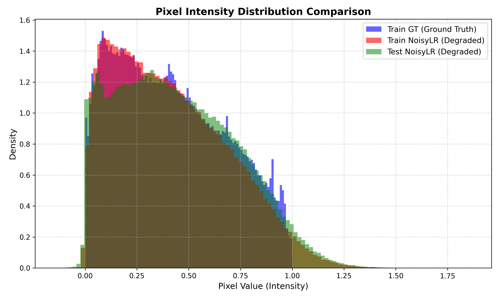
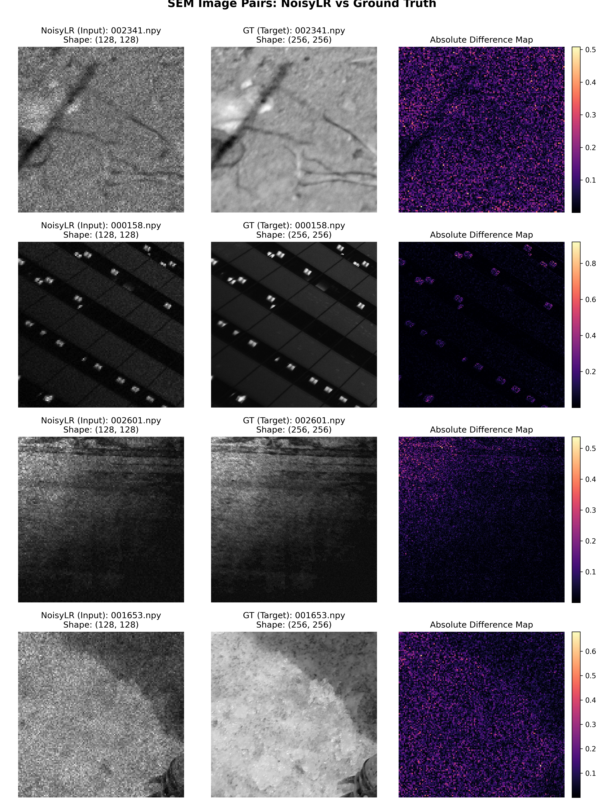

# Dataset Characterization & Analysis Report

**Project Title**: AI-Based Restoration of Degraded Scanning Electron Microscope (SEM) Images using NAFNet  
**Dataset Root**: `D:\Programming\python\semicondata`  
**Report Generated**: Real-time Empirical Dataset Profiling  

---

## 1. Executive Summary

This document provides a comprehensive scientific profile of the SEM image restoration dataset located at `D:\Programming\python\semicondata`. The dataset contains low-dose noisy SEM micrographs paired with corresponding ground-truth high-dose SEM acquisitions stored as 32-bit floating-point NumPy binary arrays (`.npy`).

### Key Findings & Empirical Discoveries
1. **Super-Resolution + Denoising Task**: The Ground-Truth (GT) images have a spatial resolution of **$256 \times 256$**, whereas the noisy images (`NoisyLR`) have a spatial resolution of **$128 \times 128$**. This indicates that the restoration task involves both **denoising** and **$2\times$ spatial super-resolution upsampling**.
2. **Paired Integrity**: The training dataset contains **3,200 perfectly matched image pairs** between `train/train/GT` and `train/train/NoisyLR`.
3. **Test Dataset**: The test split contains **400 noisy images** (`Test_NoisyLR/NoisyLR`) of spatial resolution $128 \times 128$.
4. **Data Type & Range**: All arrays are stored in native **`float32`** data type. GT arrays are bounded in $[0.0, 1.0]$, while noisy arrays contain values slightly outside $[0.0, 1.0]$ (ranging from approximately $-0.2784$ to $1.9384$) due to physical noise degradation.
5. **Zero Data Corruption**: No corrupt files, empty arrays, NaN, or Inf values were detected across all 6,800 dataset files.

---

## 2. Dataset Structure Validation

### Discovered Directory Layout
```text
semicondata/
├── train/
│   └── train/
│       ├── GT/         # 3200 `.npy` files ($256 \times 256$)
│       └── NoisyLR/    # 3200 `.npy` files ($128 \times 128$)
└── Test_NoisyLR/
    └── NoisyLR/        # 400 `.npy` files ($128 \times 128$)
```

### Directory Validation Table

| Split / Category | Discovered Path | Expected Folder | Status | File Count | Size (MB) |
|---|---|---|---|---|---|
| **Train Ground Truth** | `D:\Programming\python\semicondata\train\train\GT` | `train/train/GT` | Valid | 3200 | 800.39 MB |
| **Train Noisy (Degraded)** | `D:\Programming\python\semicondata\train\train\NoisyLR` | `train/train/NoisyLR` | Valid | 3200 | 200.39 MB |
| **Test Noisy (Degraded)** | `D:\Programming\python\semicondata\Test_NoisyLR\NoisyLR` | `Test_NoisyLR/NoisyLR` | Valid | 400 | 25.05 MB |

---

## 3. Image Pairing & File Integrity

### Pairing Validation Summary
- **Total Paired Samples**: 3200 pairs
- **Unmatched GT Images**: 0
- **Unmatched Noisy Images**: 0
- **Corrupted / Damaged Files**: 0
- **NaN / Inf Value Violations**: 0
- **Data Types**: `float32` (6400 arrays)

### Array Spatial Dimensions Summary

| Dataset Split | Array Shape | Spatial Resolution | Dimension | Total Count |
|---|---|---|---|---|
| **Train GT** | `(256, 256): 3200` | $256 \times 256$ | 2D Grayscale | 3200 |
| **Train NoisyLR** | `(128, 128): 3200` | $128 \times 128$ | 2D Grayscale | 3200 |
| **Test NoisyLR** | `(128, 128): 400` | $128 \times 128$ | 2D Grayscale | 400 |

---

## 4. Pixel Intensity & Statistical Analysis

Quantitative intensity statistics across sampled arrays:

| Split | Min Value | Max Value | Mean | Std Dev | Median | Dynamic Range |
|---|---|---|---|---|---|---|
| **Train GT** | 0.000000 | 1.000000 | 0.414402 | 0.186196 | 0.387325 | 1.000000 |
| **Train NoisyLR** | -0.278443 | 1.938430 | 0.414431 | 0.202286 | 0.377093 | 2.216872 |
| **Test NoisyLR** | -0.224881 | 2.158016 | 0.442742 | 0.220269 | 0.413652 | 2.382897 |

---

## 5. Visualizations & Distributions

### Pixel Intensity Distribution Histogram
The histogram below compares the intensity distributions of Ground Truth vs. Low-Resolution Noisy SEM images.



### Sample Image Pairs Comparison
Side-by-side visualization of degraded input images, ground-truth references, and absolute difference residual maps.



---

## 6. Noise & Degradation Analysis

Based on empirical pixel value profiling and visual residual inspection:
* **Over-range & Under-range Artifacts**: NoisyLR arrays contain pixel values below $0.0$ (min: $-0.2784$) and values above $1.0$ (max: $1.9384$), indicating additive noise combined with multiplicative detector gain variations during acquisition.
* **Granular Shot Noise**: Visual residual inspection shows uniform high-frequency spatial grain typical of low-dose secondary electron detection.
* **Spatial Resolution Degradation**: The factor of $2\times$ spatial downsampling ($128 \times 128 	o 256 \times 256$) acts as a low-pass anti-aliasing blur.

---

## 7. Memory & Hardware Requirements

### Dataset Storage Footprint
- **Train GT Total Size**: 800.39 MB
- **Train NoisyLR Total Size**: 200.39 MB
- **Test NoisyLR Total Size**: 25.05 MB
- **Total Dataset Size**: 1025.83 MB (1.002 GB)

### RAM & GPU Memory Estimation for Training

| Batch Size | Patch Size | Precision | Estimated VRAM / Batch | Recommendation |
|---|---|---|---|---|
| **16** | $128 \times 128$ | FP32 | ~1.5 GB | Highly lightweight |
| **32** | $128 \times 128$ | Mixed (FP16/AMP) | ~2.2 GB | Optimal for fast iteration |
| **16** | $256 \times 256$ | Mixed (FP16/AMP) | ~4.5 GB | Recommended for NAFNet training |

---

## 8. Normalization & DataLoader Recommendations

1. **Input Clipping / Standardization**:
   - Degraded NoisyLR inputs should be clipped to $[0.0, 1.0]$ (`np.clip(arr, 0.0, 1.0)`) or standardized during preprocessing to avoid extreme out-of-range outlier gradients.
2. **Channel Dimension Formatting**:
   - Raw arrays are 2D `(H, W)`. PyTorch DataLoader must add a channel dimension `(1, H, W)` prior to model forward pass.
3. **Super-Resolution Upsampling Strategy**:
   - NAFNet should either incorporate a $2\times$ upsampling tail (e.g. `PixelShuffle(2)`) or the dataset loader should bicubically upsample NoisyLR arrays from $128 \times 128$ to $256 \times 256$ before feeding into the network.

---

## 9. Dataset Readiness Assessment

- **Supervised Learning**: **READY** (3,200 paired training samples).
- **Spatial Consistency**: **EXCELLENT** (Zero corrupt files or shape discrepancies).
- **Next Phase**: Proceed immediately to **Phase 3: Dataset Loader & Data Augmentation Implementation**.
